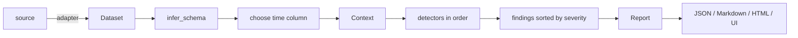

# Architecture

```
src/datasi/
  core/           Dataset (read-only view + provenance), pipeline (investigate), compare (drift)
  loaders/        source adapters: pandas, CSV/TSV(.gz), Parquet, JSON/JSONL, Polars, Arrow; register_adapter()
  schema/         semantic type inference, storage hints, identifier signals
  statistics/     descriptive, outliers, distribution, association, change points, strings, streaming
  detectors/      Detector protocol, Context (shared caches), 16 built-in detectors, registry
  findings/       Finding / Severity / Category models
  configuration/  validated Config (pydantic), thresholds, rules, privacy, performance
  reports/        Report model, Markdown and self-contained HTML renderers
  visualization/  optional matplotlib figures from a Report
  synthetic/      dataset generator with ground truth
  evaluation/     precision / recall / FPR / FNR against ground truth
  server/         stdlib HTTP server for the web UI (+ built static assets)
  cli/            argparse CLI
web/              React + TypeScript + Vite + Tailwind UI (builds into server/static)
benchmarks/       performance benchmark and research experiments (results/ committed)
```

## Pipeline



`Context` is the only object detectors see. It exposes the frame (read-only by
convention, enforced by tests), the schema, configuration and cached derived data:
string value counts, parsed numerics and datetimes, the analysis sample and the period
binning of the time column. Detectors add report material via `ctx.profile(column)` and
`ctx.section(name)`.

## Design decisions

* **No mutation.** `Dataset` keeps a shallow, relabelled copy; nothing is written in
  place. Tests assert inputs are unchanged after an investigation.
* **Plugin detectors.** The `Detector` protocol is `name` + `analyze(ctx)`. Built-ins
  subclass `BaseDetector` for metadata and a finding factory. Failures are isolated.
* **Determinism.** Every random step (sampling, isolation forest, holdout splits,
  synthetic data) is seeded from `performance.random_state`; `reference_time` pins
  "now". Fixture tests assert identical findings across repeated runs.
* **Light core.** numpy, pandas, scipy, scikit-learn, pydantic, pyyaml. pyarrow and
  matplotlib are optional; the web server uses only the standard library.
* **Scalability path.** Adapters accept `nrows`; heavy analyses use a capped sample;
  streaming statistics are mergeable so a future chunked engine can reuse them.
